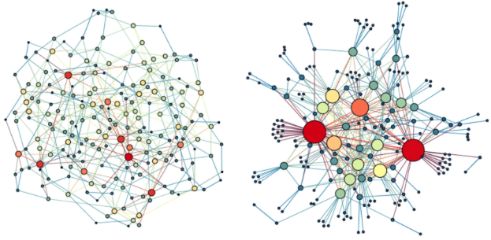

<!-- README.md is generated from README.Rmd. Please ed  it that file -->

```{r, include = FALSE}
knitr::opts_chunk$set(
  collapse = TRUE,
  comment = "#>",
  fig.path = "man/figures/README-",
  out.width = "100%"
)

traits <- read.csv("man/figures/traits.package.csv")
counts <- read.csv("man/figures/nano.package.csv")
row.names(counts) <- counts$STRING_gene
counts <- counts[,-1]

library(knitr)
```

# BioNetworks

<!-- badges: start -->
<!-- badges: end -->

The goal of BioNetworks is to analyze biological networks using graph theory concepts.


## Installation

Install the Beta version of BioNetworks:

``` r
library(devtools)
devtools::install_github("yzohdy/BioNetworks")
```

## Workflow

This is a basic example which shows you how to analyze a set of differential expressed genes (DEGs) or proteins.The following example outlines the use of this package to identify a set of DEGs in a microarray dataset. However, this package would still work with RNA-Seq or proteomics data.

```{r example,message=FALSE, warning=FALSE}
library(BioNetworks)
```

## 1 - Identification of differentially expressed genes or proteins
The first step of the progress is identifying a set of differentially expressed genes (DEGs) or proteins. If you have a list of DEGs without expression data, you can skip to step 3.

### 1.1 - Using data from RNA-Sequencing
```{r identify degs rna-seq,message=FALSE, warning=FALSE,eval=FALSE}

#Identification of DEGs using DESeq2

#Functional annotation of the identifed DEGs
DEG.fun <- degs_f_annotation(DEG, species = "Hs")
```
``` {r table, echo= FALSE,eval=FALSE}
DEG.fun <- DEG.fun %>% arrange(desc(`-log10(p.adjust)`))
subset_DEG.fun <- DEG.fun[1:5, c(2,1,3,6,11)]
kable(subset_DEG.fun,row.names = FALSE)
```

### 1.2 - Using data from microarray
```{r identify degs, eval=FALSE,message=FALSE, warning=FALSE}

#Identification of DEGs from a normalized Nanostring dataset (counts)
DEG <- microarray_degs(data = counts, control = "CTL", condition = "RX")

#Functional annotation of the identifed DEGs
DEG.fun <- degs_f_annotation(DEG, species = "Hs")
```

## 2 - Genes co-expression
Before constructing the interaction network, use either of the following functions to compute a co-expression score for genes present within your dataset. The gene_coexpression() function calculates the gene co-expression scores using either a pearson correlation r or a scaled correlation value on the WGCNA functions.
Note: The "scale" method is optimal for handling large datsets with a large number of genes (e.g. RNA-Seq), while pearsons correlation is better for small datasets (e.g. mircoarray data).
```{r coexpr,message=FALSE, warning=FALSE,eval=FALSE}
coexpr.df <- genes_coexpression(counts, method = "scaled")
```

## 3 - Interaction network construction
Next we construction an interaction network from the pre-identified DEGs.

### 3.1 - Identification of node interactions.
First we create an interaction dataframe using pre-identified interaction from STRING database.
```{r iter, eval=FALSE, message=FALSE, warning=FALSE}
#Identifying interactions - DEG is a vector containing gene symbols 
int.df <- ident_interactions(DEG, species = "Hs")

#Merging interactions with computed co-expression scores
full_int.df <- merge_int_expr(int.df,coexpr.df, int_cols = c("from","to"),coexpr_cols = c("Var1", "Var2"))
```

### 3.2 - Construction and visulization of network
The network is then constructed with each node corresponding to a gene and each edge represents nodal interaction weighted by co-expression values.
```{r viz, eval=FALSE, message=FALSE, warning=FALSE}
#Network construction
study.net <- construct_network(full_int.df, interaction_score = "Freq")

#Visualize network with Cytoscape - make sure Cytoscape app is open before running this function
visualize_net(study.net)
```

## 4 - Graph theory analysis

### 4.1 - Checking the presence of a scale-free network topology
Almost all biological networks exhibit a scale-free topology with centeral highly connected nodes and a decrease in connectivity at the network periphery, show by a power-law distribution of node degrees.
```{r pl,eval=FALSE, message=FALSE, warning=FALSE}
plot_degrees_dist(study.net)
```

### 4.2 - Construction of random networks
A cornerstone of comparing the topology of a network is by comparing it with sets of randomly constructed network. The construct_rand_net() constructs a list of random networks with of similar weighted degree distribution based on Fabien Viger and Matthieu Latapy's algorithm.
```{r ran, eval=FALSE, message=FALSE, warning=FALSE}
rand.nets <- construct_rand_net(study.net, number = 100)
```

### 4.3 - Clustering coefficient
We then compare the clustering coefficient of the study network with the randomly constructed networks to ensure the presence of a scale-free network.
```{r cc, eval=FALSE, message=FALSE, warning=FALSE}
#Calculate the clustering coefficient for the study networks
net.clu.coeff <- net_clu_coeff(study.net)

#Calculate the clustering coefficient for the random networks
rand.clu.coeff <- rand_net_clu_coeff(rand.nets)

#One sample t-test between random networks clustering coefficient and the study network
clu.coeff.t.test <- t.test(rand.clu.coeff, mu= net.clu.coeff)

```

### 4.4- Rich-club analysis
The ‘rich-club’ phenomenon refers to the tendency of nodes with high centrality, the dominant elements of a network, to form tightly interconnected subnetworks, and it is one of the crucial properties accounting for the formation of scale-free biological network. The following functions demonstrate the identification of network core nodes using the rich-club analysis. The compare_rc_coeff() function calculates the rich-club coefficient for both the study network and the list of random networks and calculates a normalized coefficient. The normalized coefficient is then used to set a cut-off to identify the ndoes with the highest degrees of connectivity.

```{r rc, eval=FALSE, message=FALSE, warning=FALSE}
#Calculating rich-club coefficient
rc.coeff.df <- compare_rc_coeff(study.net, rand.nets)

#Identify core nodes
core.nodes <- core_nodes(study.net, rc.coeff.df)

#Visualizing the identify core nodes
visualize_net(core.nodes)

#Comparing the nodal degrees between the core nodes and other network nodes
compare_rc_degrees(study.net, core.nodes)

#Functional annotation of the core nodes - fix!!
core.fun <- degs_f_annotation(core.nodes, species = "Hs") 
```

## 5 - Correlation between core nodes and traits
We then investigate the correlation between the identified core nodes and traits. Correlation are made based on the PCA compute eigengenes for the core nodes. Those correlation are then compared with multiple iterations of random sampling of non-core nodes.

```{r predi, eval=FALSE, message=FALSE, warning=FALSE}
#Calculate core nodes eigengenes
core.nodes.eg <- core_eigengenes(nano.counts,study.net,core.nodes)

#Calculate the non-core nodes eigengenes
noncore.nodes.eg <- non_core_eigengenes(nano.counts, study_network, core.nodes, number =100)

#Correlate with specific trait
core.correlation <- core_nodes_correlation(core.nodes.eg, noncore.nodes.eg, outcomes.df, tested_outcome = "survival")


```


