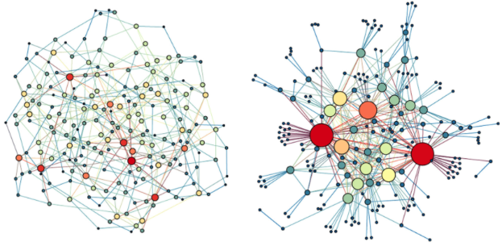

<!-- README.md is generated from README.Rmd. Please ed  it that file -->

# BioNetworks

<!-- badges: start -->
<!-- badges: end -->

BioNetworks is an R package for analyzing biological networks using
graph theory concepts. 

## Installation

Install the Beta version of BioNetworks:

``` r
library(devtools)
devtools::install_github("yzohdy/BioNetworks")
```

## Workflow

This is a basic example which shows you how to analyze a set of
differential expressed genes (DEGs) or proteins.The following example
outlines the use of this package to identify a set of DEGs in a
microarray dataset. However, this package would still work with RNA-Seq
or proteomics data.

``` r
library(BioNetworks)
```

## 1 - Identification of differentially expressed genes or proteins

The first step of the progress is identifying a set of differentially
expressed genes (DEGs) or proteins. If you have a list of DEGs without
expression data, you can skip to step 3.

### 1.1 - Using data from RNA-Sequencing

``` r
#Identification of DEGs using DESeq2
library(DESeq2)
dds <- DESeqDataSetFromMatrix(countData = data, colData = coldata, design = ~ condition)
dd <- DESeq(dds)
counts <- counts(dd)

res <- results(dd, contrast=c("condition", "RX", "CTL"))
res<- na.omit(res)
res.df <- as.data.frame(res)
res.df$genes <- rownames(res.df)
DEG_up_reg <- res.df[res.df$log2FoldChange > 1 & res.df$padj < 0.05, ]
DEG_down_reg <- res.df[res.df$log2FoldChange < -1 & res.df$padj < 0.05, ]
```

### 1.2 - Using data from microarray

``` r
#Identification of DEGs from a normalized microarray dataset
DEG <- microarray_degs(data = counts, control = "CTL", condition = "RX")
```

## 2 - Genes co-expression

Before constructing the interaction network, compute a co-expression
score for DEGs. The gene_coexpression() function calculates the gene
co-expression scores using either a pearson correlation “pearson” or a
scaled correlation value using the WGCNA algorithms “scaled”.

``` r
coexpr.df <- genes_coexpression(data= counts, deg = DEG, method = "scaled")
```

## 3 - Interaction network construction

Next we construction an interaction network from the pre-identified
DEGs.

### 3.1 - Identification of node interactions.

First we identify interaction between the DEGs using pre-identified PPI
(protein-protein interactions) from the STRING database. You can
increase to threshold in ident_interactions() to filter for PPIs with
higher confidence of interaction.

``` r
#Identifying interactions - DEG is a vector containing gene symbols
int.df <- ident_interactions(DEG, species = "Hs", threshold = 200)

#Merging interactions with computed co-expression scores
full_int.df <- merge_int_expr(int.df,coexpr.df, int_cols = c("from","to"),coexpr_cols = c("Var1", "Var2"))
```

### 3.2 - Construction and visulization of network

The network is then constructed with each node corresponding to a gene
and each edge represents nodal interaction weighted by co-expression
values.

``` r
#Network construction
study.net <- construct_network(full_int.df, interaction_score = "Freq")
```

Make sure to open the Cytoscape application before running
visualize_net()

``` r
#Visualize network with Cytoscape
visualize_net(study.net)
```

### 3.3 - Network subclustering

## 4 - Graph theory analysis

### 4.1 - Checking the presence of a scale-free network topology

Almost all biological networks exhibit a scale-free topology with
central highly connected nodes and a decrease in connectivity at the
network periphery, show by a power-law distribution of node degrees.

``` r
plot_degrees_dist(study.net)
```

### 4.2 - Construction of random networks

A cornerstone of comparing the topology of a network is by comparing it
with sets of randomly constructed network. The construct_rand_net()
constructs a list of random networks with of similar weighted degree
distribution based on Fabien Viger and Matthieu Latapy’s algorithm.

``` r
rand.nets <- construct_rand_net(study.net, number = 100)
```

### 4.3 - Clustering coefficient

We then compare the clustering coefficient of the study network with the
randomly constructed networks to ensure the presence of a scale-free
network.

``` r
#Calculate the clustering coefficient for the study networks
net.clu.coeff <- net_clu_coeff(study.net)

#Calculate the clustering coefficient for the random networks
rand.clu.coeff <- rand_net_clu_coeff(rand.nets)

#One sample t-test between random networks clustering coefficient and the study network
clu.coeff.t.test <- t.test(rand.clu.coeff, mu= net.clu.coeff)
```

### 4.4- Rich-club analysis

The ‘rich-club’ phenomenon refers to the tendency of nodes with high
centrality, the dominant elements of a network, to form tightly
interconnected subnetworks, and it is one of the crucial properties
accounting for the formation of scale-free biological network. The
following functions demonstrate the identification of network core nodes
using the rich-club analysis.

The compare_rc_coeff() function calculates the rich-club coefficient for
both the study network and the list of random networks and calculates a
normalized coefficient. The normalized coefficient is then used to set a
cut-off to identify the ndoes with the highest degrees of connectivity.

``` r
#Calculating rich-club coefficient
rc.coeff.df <- compare_rc_coeff(study.net, rand.nets)
```

A rich-club organization is characterized by having a normalized
coeffiecient \> 1 when compared with random networks; i.e. the study
network has a small world organization with increasing node degrees
towards the center of the network indicating a “small-world
organization.” Accordingly, The core_nodes() function identifies the
network core nodes using one of two methods “all” or “peak”. The “all”
method scales the \>1 normalized rich-club coefficients between 0-10
giving the user the ability to cut off the core network at vary levels.
On the other hand, “peak” identifies the highest value of the normalized
rich-club coefficient and uses it as cut-off

``` r
#Identify core nodes
core.nodes <- core_nodes(study.net, rc.coeff.df, method = "all", cutoff = 0)

#Visualizing the identify core nodes
visualize_net(core.nodes)

#Comparing the nodal degrees between the core nodes and other network nodes
compare_rc_degrees(study.net, core.nodes)
```

## 5 - Correlation between core nodes and traits

We then investigate the correlation between the identified core nodes
and traits. Correlation are made based on the PCA compute eigengenes for
the core nodes. Those correlation are then compared with multiple
iterations of random sampling of non-core nodes.

``` r
#Calculate core nodes eigengenes
core.nodes.eg <- core_eigengenes(nano.counts,study.net,core.nodes)

#Calculate the non-core nodes eigengenes
noncore.nodes.eg <- non_core_eigengenes(nano.counts, study_network, core.nodes, number =100)

#Correlate with specific trait
core.correlation <- core_nodes_correlation(core.nodes.eg, noncore.nodes.eg, outcomes.df, tested_outcome = "survival")
```

## Disclosure

BioNetworks uses functions from the following packages. All rights
reserved to the original package authors. WGCNA
(<doi:10.1186/1471-2105-9-559>); STRINGdb (<doi:10.1093/nar/gkac1000>);
igraph (igraph.org); brainGraph (github.com/cwatson/brainGraph); RCy3
(<doi:10.12688/f1000research.20887.3>); tmod
(<doi:10.1093/bioinformatics/btz447>)
